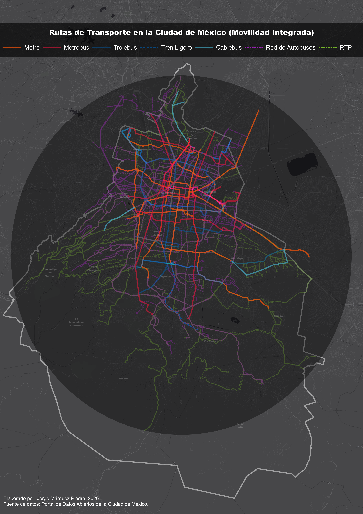
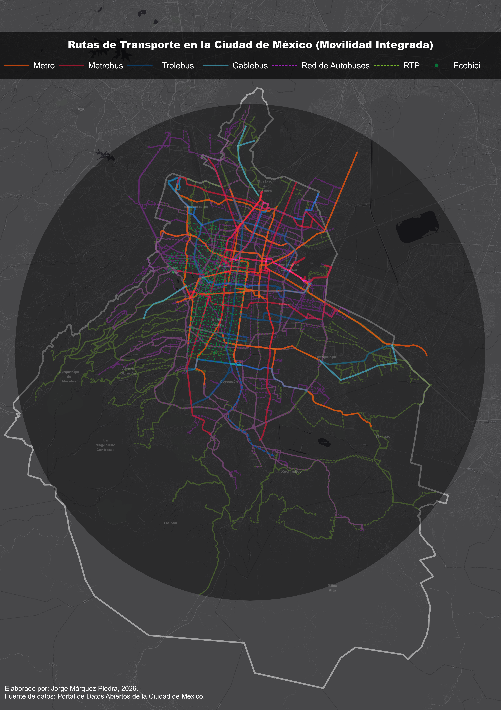

# Transporte-Movilidad-Integrada-Ciudad-de-Mexico-QGIS

**Sistema de Información Geográfica: QGIS**

**Entornos: QGIS**

## Este proyecto presenta el proceso de recopilación, carga, limpieza y procesamiento de los datos espaciales de los diferentes modos de transporte del sistema de Movilidad Integrada en la Ciudad de México. El objetivo fue transformar datos crudos de portales oficiales en un recurso visual limpio para llevar a cabo análisis de movilidad urbana.

****

****

<iframe src="https://www.google.com/maps/d/u/0/embed?mid=1o-Ruovv2VSh5qAxXpk6FmW_5YYpHk14&ehbc=2E312F" width="640" height="480"></iframe>
